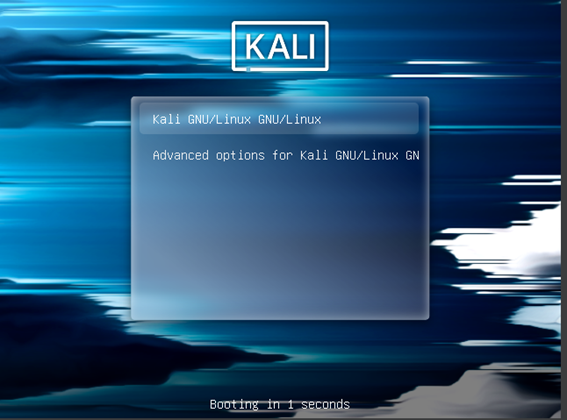
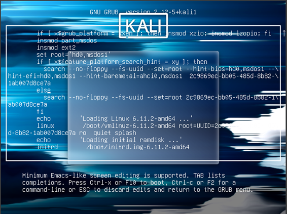
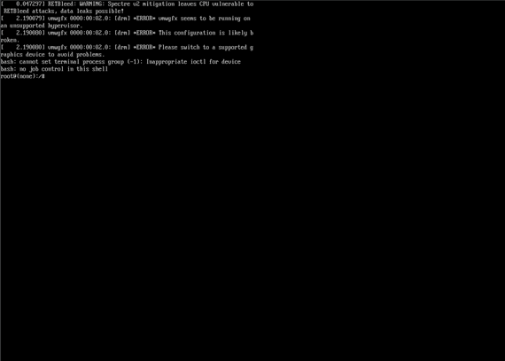

# ✔️​ Bypass o Recuperación de Contraseña en Kali Linux 2024

**🇪🇸​/  -Este tutorial te guiará paso a paso para recuperar o cambiar la contraseña en Kali Linux 2024 en caso de que la hayas olvidado.**

**​🇪🇬 /  -Kali bypass, This tutorial will guide you step by step to recover or change the password in Kali Linux 2024 in case you have forgotten it.**

## 1. Inicio

1. Abre Kali Linux y espera hasta que aparezca el GRUB.  
   Cuando estés en el menú del GRUB, presiona la tecla **`e`**.
   
   

---

2. Localiza la línea que comienza con `Linux /boot/vmlinuz`.
  
   

   Dentro de esta línea, busca la sección que dice `ro quiet splash` y cámbiala por: `rw quiet splash \               
init=/bin/bash`               *OJO! Al salto de linea*

---

3.Pulsamos “Control X “ y veriamos que se nos ha lanzado una BASH como ROOT

   

---

4.Ahora vamos a cambiarle la contraseña al usuario “Kali”
Usamos “Passwd kali”
Os saldra “New password” poneis una contraseña y os saldra para confirmarla

 

---
 
5. ### Por ultimo “reboot -f “ para aplicar el reinicio.
   
